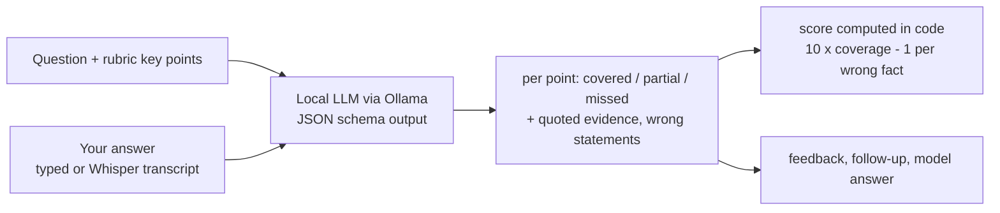

# AI Mock Interviewer

Practice campus-placement interviews out loud. The app asks DBMS, OS, CN, OOP,
DSA, ML and HR questions, listens to your answer (or lets you type), and a
**local LLM** checks it against the key points a real interviewer listens for.
Every point gets ✅ covered / 🟡 partial / ❌ missed with the words from
your answer as evidence, then feedback, a follow-up question and a model
answer. Runs fully offline on a laptop GPU via Ollama: free, and your answers
never leave your machine.

**Live demo: https://vivekvagale.github.io/mock-interviewer/** : runs Qwen3-4B
in your browser with WebLLM (desktop Chrome or Edge with WebGPU; ~2.3 GB
download once, then cached). Voice answers are transcribed on-device with
Whisper tiny.en.

## Can the grader be trusted?

An LLM judge is only useful if its score means something. The grader is
tested on 12 questions, each with answers written on purpose to be **strong**,
**medium**, **weak**, **waffle** (long, confident, zero substance) and
**paraphrase** (complete and correct, but avoiding the rubric's words, to catch
keyword matching). The answers are synthetic and labeled as such in
`eval/graded_answers.json`.

| Model | Role | Ordering correct | Spearman | Waffle below medium | Paraphrase within 2 | Re-grade spread | Failed replies | Sec / grade |
|---|---|---|---|---|---|---|---|---|
| qwen3:8b | local reference | 12/12 | 0.981 | 12/12 | 12/12 | 0.05 | 0/84 | 9.0 |
| qwen3:4b | browser default | 12/12 | 0.982 | 12/12 | 12/12 | 0.10 | 0/84 | 6.4 |
| qwen3.5:2b |  | 12/12 | 0.950 | 9/12 | 11/12 | 0.90 | 0/84 | 7.2 |
| qwen3:1.7b |  | 9/12 | 0.921 | 9/12 | 9/12 | 0.39 | 0/84 | 7.8* |
| llama3.2:3b |  | 2/12 | 0.443 | 3/12 | 11/12 | 2.21 | 14/84 | 7.8 |

Each model graded the same 60 answers (12 questions x 5 kinds) at temperature 0,
plus one re-grade of the strong and medium answers at temperature 0.7 for the
spread. Seconds per grade on an RTX 4060 laptop GPU. "Failed replies" are
answers the model returned as broken JSON (cut off at the length cap), which a
user would see as an error; they score 0. \* qwen3:1.7b ran while the GPU was
also training another model, so its time is inflated.

**What this shows**

- **qwen3:4b matches the 8B reference on every check**, so the browser version
  uses it. The browser runs MLC's 4-bit build of the same model, not the exact
  Ollama file, so treat the browser as "same model, close quantization".
- **Size is not everything**: llama3.2:3b is bigger than qwen3.5:2b and qwen3:1.7b
  but ordered only 2 of 12 questions correctly, broke its JSON 14 times, and its
  scores swung by 2.2 points on re-grade.
- **Caveat**: the rubrics and all test answers were written by the same person.
  The paraphrase answers were added to catch keyword matching, but the real test
  is agreement with human graders on classmates' answers (next step).

## How grading works



- The LLM does narrow yes/no-style judgments per key point; the arithmetic is
  done in code, never by the model.
- Structured output (JSON schema) means the reply always parses.
- Temperature 0 for grading: same answer, same score.

Design decisions: [docs/INTERVIEW_NOTES.md](docs/INTERVIEW_NOTES.md).

## Run it

Install [Ollama](https://ollama.com), then:

```powershell
ollama pull qwen3:8b
uv venv --python 3.11 .venv
.venv\Scripts\activate
uv pip install -r requirements.txt

streamlit run app.py                          # the interview
python -m src.evaluate --model qwen3:8b       # grader checks (~20 min)
python -m pytest                              # offline tests, no LLM needed
```

Voice answers use `faster-whisper` (base.en, ~140 MB, downloaded on first use).

## Author

**Vivek Vagale** - [@VivekVagale](https://github.com/VivekVagale)
