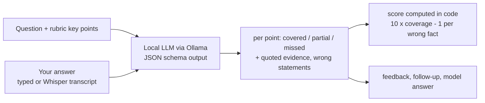

# AI Mock Interviewer

Practice campus-placement interviews out loud. The app asks DBMS, OS, CN, OOP,
DSA, ML and HR questions, listens to your answer (or lets you type), and a
**local LLM** checks it against the key points a real interviewer listens for.
Every point gets ✅ covered / 🟡 partial / ❌ missed with the words from
your answer as evidence, then feedback, a follow-up question and a model
answer. Runs fully offline on a laptop GPU via Ollama: free, and your answers
never leave your machine.

## Can the grader be trusted?

An LLM judge is only useful if its score means something. The grader is
tested on 12 questions, each with answers written on purpose to be **strong**,
**medium**, **weak**, and **waffle** (long, confident, zero substance). The
answers are synthetic and labeled as such in `eval/graded_answers.json`.

| Check | qwen3:8b |
|---|---|
| Strong > medium > weak, per question | 12/12 |
| Spearman correlation, intended quality vs score | 0.981 |
| Waffle scored below a medium answer | 12/12 (all waffle scored 0) |
| Score spread when re-graded at temperature 0.7 | 0.11 points |
| Seconds per grade (RTX 4060) | 9.8 |

**Caveat:** the rubrics and the strong answers were written by the same
person, so strong answers use rubric wording. A harder **paraphrase** test
(correct answers in completely different words) has been added to check
keyword-matching; its results and a llama3.2:3b comparison are being added.
The real test is human agreement on classmates' answers (next step).

## How grading works



- The LLM does narrow yes/no-style judgments per key point; the arithmetic is
  done in code, never by the model.
- Structured output (JSON schema) means the reply always parses.
- Temperature 0 for grading: same answer, same score.

Design decisions: [docs/INTERVIEW_NOTES.md](docs/INTERVIEW_NOTES.md).

## Run it

Install [Ollama](https://ollama.com), then:

```powershell
ollama pull qwen3:8b
uv venv --python 3.11 .venv
.venv\Scripts\activate
uv pip install -r requirements.txt

streamlit run app.py                          # the interview
python -m src.evaluate --model qwen3:8b       # grader checks (~20 min)
python -m pytest                              # offline tests, no LLM needed
```

Voice answers use `faster-whisper` (base.en, ~140 MB, downloaded on first use).

## Author

**Vivek Vagale** - [@VivekVagale](https://github.com/VivekVagale)
